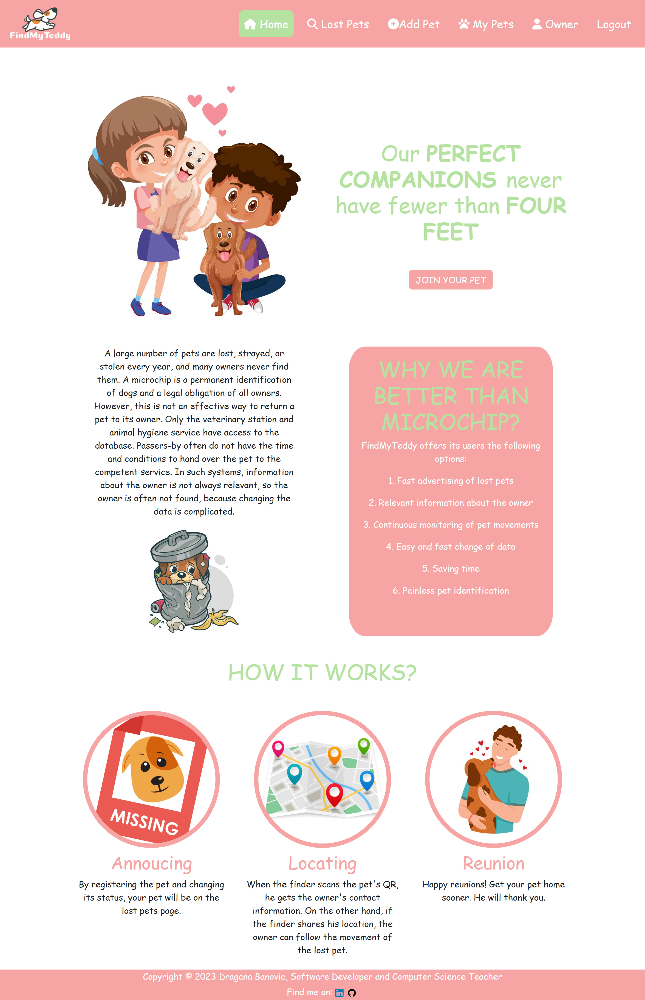
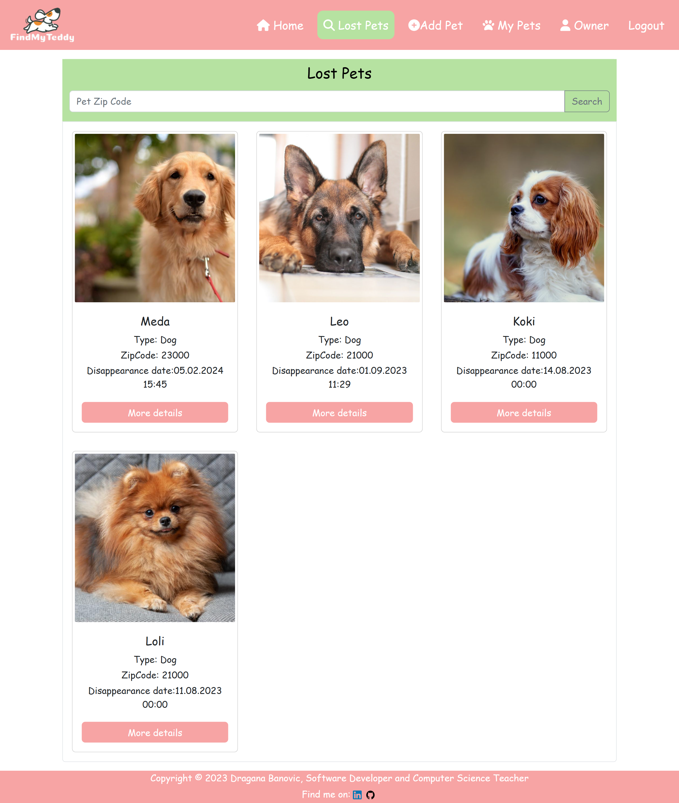

# FindMyTeddy
<a href="https://findmyteddy.azurewebsites.net">https://findmyteddy.azurewebsites.net<a>

  FindMyTeddy web application offers its users fast advertising of lost pets, relevant information about the owner, continuous monitoring of pet movements, easy and fast change of data, painless pet identification.

# Technologies
<ul>
  <li>C#</li>
  <li>ASP.NET</li>
  <li>Entity Framework</li>
  <li>TypeScript</li>
  <li>React</li>
</ul>

   

